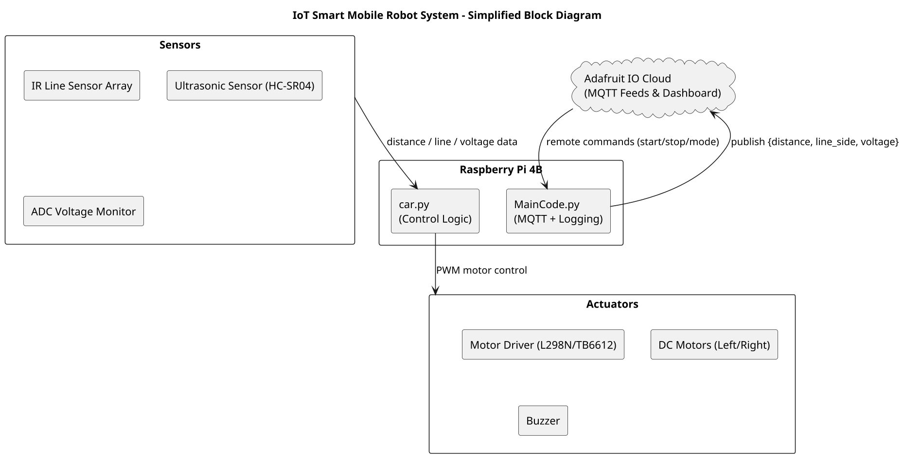

# IoT Line Tracking Robot

## Team Members
- **Étienne Khalil** (2230936)  
- **Jake Tremblay** (2330184)

---

## Project Overview
This project consists of building a robot using a Raspberry Pi and having it automated via APIs to steer and take photos of its environment while following a direct path dictated by a black line of tape.  
The robot is designed as a small car that can be steered using our API or automatically through sensors that recognize the path. It also takes photos and uses sensors to analyze its environment, sending the data to a cloud platform so it can be viewed in real time.

The purpose of this project is to show how IoT technology can be combined with robotics to make a system that can autonomously navigate and communicate via cloud-based connections.  
Such a robot can have real-world benefits, such as:
- Detecting unexpected objects or guests in a home.  
- Serving as an automated inspection system in warehouse environments.  
- Performing remote monitoring or data collection as a ground-based drone.

---

## Block Diagram


# Wiring Diagram and Photos


https://youtu.be/6_7chIJ2dfs?si=FsjMMmt1L664-Rru

# Setup Instructions

Flash and set up Raspberry Pi OS.

Enable I2C, SPI, and camera using sudo raspi-config.

Connect the sensors, motors, and driver modules according to the wiring diagram.

Install dependencies:
```bash
sudo apt update
sudo apt install python3-pip python3-opencv
pip install adafruit-io gpiozero adafruit-blinka paho-mqtt
```
Edit config.json with your Adafruit IO username and key.

# How to Run

After installing all required files on your Raspberry Pi, enter your Adafruit IO credentials in the JSON configuration file.

In a terminal, navigate to the project directory:
```bash
cd ~/location/of/the/file/ProjectMs2
```
Choose a mode:

infrared – follows a black tape line using IR sensors.

ultrasonic – moves forward and avoids obstacles with ultrasonic sensing.

Run the command:
```bash
python MainCode.py infrared
```
or
```bash
python MainCode.py ultrasonic
```
Press CTRL + C to stop execution.

# What Could Have Gone Better

One of the main difficulties we faced was managing our collaboration since our schedules often conflicted.
This made it challenging to find time to work together consistently, especially during testing and integration.
We also realized that we did not always conduct enough research before beginning each step, which led to avoidable mistakes early on.
Some components took longer to configure than expected because of this lack of preparation.
Despite these issues, we learned to communicate more effectively and plan ahead, which helped us complete the project successfully.
